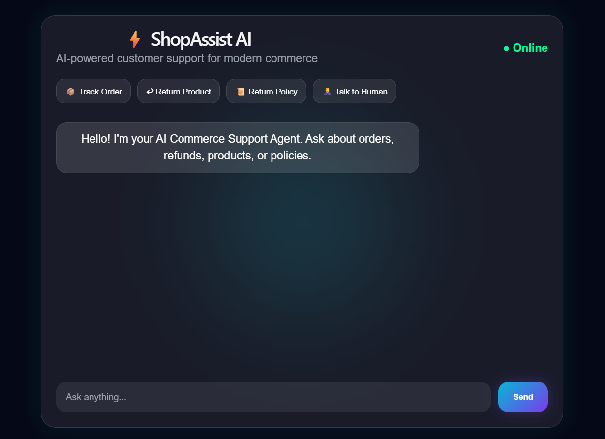
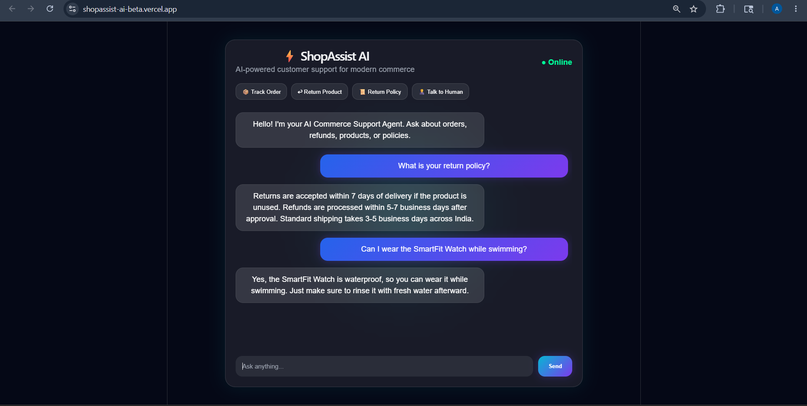

# ShopAssist AI

AI-powered customer support automation for modern e-commerce.

ShopAssist AI is a hybrid AI customer support assistant that automates repetitive e-commerce workflows such as order tracking, refunds, returns, policy queries, and product support, while also handling natural customer conversations through AI reasoning.

## Live Demo

**Frontend:** https://shopassist-ai-beta.vercel.app  
**Backend API:** https://shopassist-backend.onrender.com

---

## Screenshots

### Home Interface


### Live AI Conversation


---

## Problem Statement

E-commerce support teams spend significant time handling repetitive customer queries like order tracking, refund requests, return eligibility, and product FAQs. This leads to slower response times, higher operational costs, and inconsistent customer experiences.

ShopAssist AI solves this by automating common support workflows while enabling AI-powered conversational assistance.

---

## Features

- Order tracking workflow
- Refund / return initiation
- Shipping / refund / return policy support
- Product FAQ handling
- Human escalation detection
- AI conversational assistance
- Sentiment-aware support routing
- Hybrid deterministic + LLM architecture

---

## Architecture

```text
User
 ↓
React Frontend (Chat UI)
 ↓
REST API (/chat)
 ↓
Express Backend
 ↓
Intent Router
 ├── Order Tracking
 ├── Refund / Return Workflow
 ├── Policy Handler
 ├── Product Query Handler
 └── AI Reasoning Layer
 ↓
Response Engine
```

---

## Tech Stack

**Frontend**
- React
- Vite
- CSS

**Backend**
- Node.js
- Express.js
- Axios

**AI**
- OpenRouter API
- Multi-model fallback routing

**Deployment**
- Vercel
- Render
- GitHub

---

## Documentation

- [Product Document](./docs/ShopAssist_AI_Product_Document.pdf)
- [Technical Document](./docs/ShopAssist_AI_Technical_Document.pdf)

---

## Example Queries

```text
Where is my order?
ORD1002

I want refund
ORD1001

What is your return policy?

Is SmartFit Watch waterproof?

Can I wear the SmartFit Watch while swimming?

I'm not happy with this experience
```

---

## Local Setup

```bash
git clone https://github.com/samparkhim/shopassist-ai.git
cd shopassist-ai
npm install
cd backend
npm install
```

Create `.env` inside backend:

```env
OPENROUTER_API_KEY=your_api_key_here
```

Run backend:

```bash
node server.js
```

Run frontend:

```bash
cd ..
npm run dev
```

---

## Future Scope

- Shopify integration
- CRM integration
- multilingual support
- voice support
- analytics dashboard
- real human ticket routing

---

## Why ShopAssist AI?

Unlike rigid bots or unreliable generic chatbots, ShopAssist AI combines workflow reliability with AI reasoning to deliver practical and scalable customer support automation.